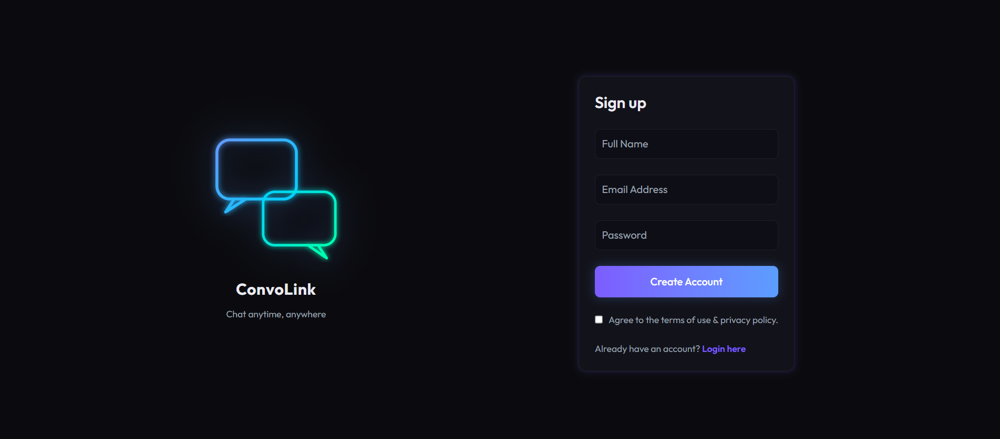
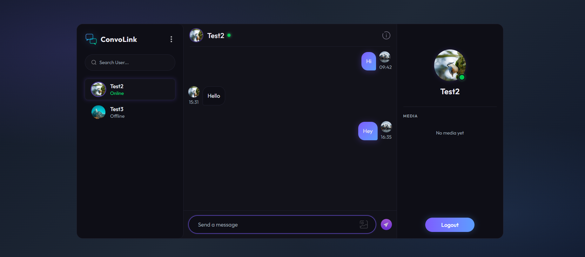
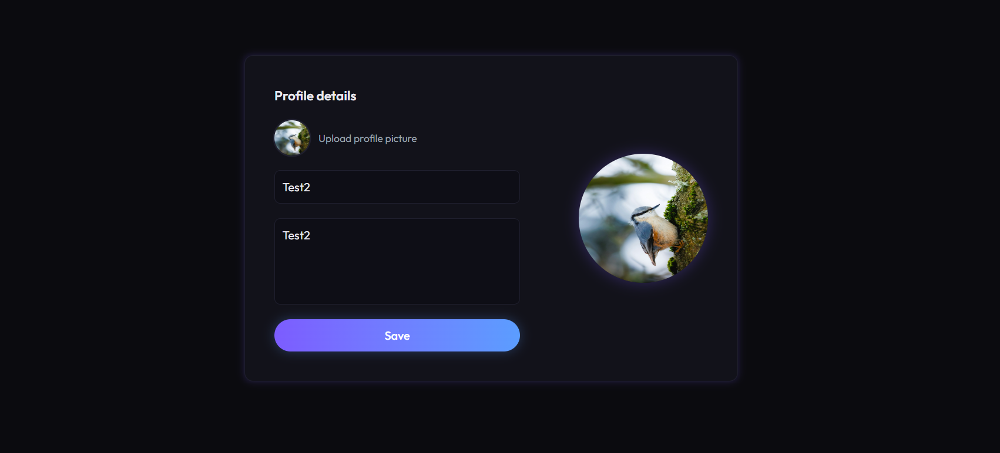

<div align="center">

# 💬 ConvoLink

### A Real-Time Full-Stack Chat Application

[](https://react.dev/)
[](https://nodejs.org/)
[](https://mongodb.com/)
[](https://socket.io/)
[](https://cloudinary.com/)
[](https://tailwindcss.com/)

</div>

---

## 📌 Project Description

**ConvoLink** is a production-ready, real-time one-to-one chat application built with the MERN stack and Socket.IO. It features secure JWT-based authentication, live online presence tracking, media sharing via Cloudinary, and optimized unread message counts powered by MongoDB aggregation pipelines.

---

## ✨ Features

- 🔐 **Secure Authentication** — JWT access & refresh tokens with HTTP-only cookies and bcrypt password hashing
- ⚡ **Real-Time Messaging** — Instant one-to-one message delivery using WebSockets (Socket.IO)
- 🟢 **Online Presence** — Live online/offline status and `lastSeen` tracking via socket connection events
- 📬 **Unread Message Badges** — Efficient per-user unread counts using MongoDB aggregation (no N+1 queries)
- 🖼️ **Media Sharing** — Image upload with Multer + Cloudinary; stores `url` and `public_id` per message
- ✅ **Read Receipts** — `isSeen` flag updated in real-time when a conversation is opened
- 👤 **Profile Management** — Update display name, bio, and avatar (uploaded to Cloudinary)
- 📱 **Responsive UI** — Component-driven React frontend with Tailwind CSS and dark modern aesthetics

---

## 🛠️ Tech Stack

| Layer | Technology |
|---|---|
| **Frontend** | React 19, Vite, Tailwind CSS v4, React Router v7 |
| **Backend** | Node.js, Express v5 |
| **Database** | MongoDB, Mongoose |
| **Real-Time** | Socket.IO v4 (WebSockets) |
| **Auth** | JWT (Access + Refresh Tokens), bcrypt, HTTP-only Cookies |
| **Media** | Multer (file handling), Cloudinary (cloud storage) |
| **HTTP Client** | Axios |
| **Notifications** | React Hot Toast |

---

## 📁 Project Structure

```
chat-app/
├── Backend/
│   └── src/
│       ├── controllers/        # Business logic (user, message)
│       ├── models/             # Mongoose schemas (User, Message)
│       ├── routes/             # Express API routes
│       ├── middlewares/        # JWT auth, Multer upload
│       ├── socket/             # Socket.IO init & user-socket map
│       ├── utils/              # AsyncHandler, ApiError, ApiResponse, Cloudinary
│       ├── db/                 # MongoDB connection
│       ├── app.js              # Express app setup
│       └── server.js           # HTTP server entry point
│
└── client/
    └── src/
        ├── components/         # Reusable UI components
        ├── context/            # React context (Auth, Socket, Chat)
        ├── pages/              # Route-level pages
        └── main.jsx            # App entry point
```

---

## 🔌 API Reference

### Auth Routes — `/api/v1/auth`

| Method | Endpoint | Auth | Description |
|---|---|---|---|
| `POST` | `/register` | ❌ | Register with name, email, password & avatar |
| `POST` | `/login` | ❌ | Login and receive JWT cookies |
| `POST` | `/logout` | ✅ | Invalidate session and clear cookies |
| `POST` | `/refresh-token` | ❌ | Rotate access token using refresh token |
| `PATCH` | `/update-account` | ✅ | Update name and bio |
| `PATCH` | `/update-avatar` | ✅ | Upload new avatar to Cloudinary |
| `GET` | `/check` | ✅ | Verify current auth session |

### Message Routes — `/api/v1/messages`

| Method | Endpoint | Auth | Description |
|---|---|---|---|
| `GET` | `/users` | ✅ | Fetch sidebar users with unread counts |
| `GET` | `/:id` | ✅ | Get full conversation + mark messages as seen |
| `POST` | `/send/:id` | ✅ | Send text or image message |
| `PATCH` | `/seen/:messageId` | ✅ | Mark a specific message as seen |

---

## ⚙️ Getting Started

### Prerequisites

- Node.js `>= 18.x`
- MongoDB Atlas account (or local MongoDB instance)
- Cloudinary account

---

### 1. Clone the Repository

```bash
git clone https://github.com/your-username/chat-app.git
cd chat-app
```

---

### 2. Backend Setup

```bash
cd Backend
npm install
```

Create a `.env` file inside `Backend/`:

```env
PORT=8000
MONGODB_URI=your_mongodb_connection_string
CORS_ORIGIN=http://localhost:5173

ACCESS_TOKEN_SECRET=your_access_token_secret
ACCESS_TOKEN_EXPIRY=15m

REFRESH_TOKEN_SECRET=your_refresh_token_secret
REFRESH_TOKEN_EXPIRY=7d

CLOUDINARY_CLOUD_NAME=your_cloud_name
CLOUDINARY_API_KEY=your_api_key
CLOUDINARY_API_SECRET=your_api_secret
```

Start the backend dev server:

```bash
npm run dev
```

> Server runs on `http://localhost:8000`

---

### 3. Frontend Setup

```bash
cd ../client
npm install
```

Create a `.env` file inside `client/`:

```env
VITE_API_BASE_URL=http://localhost:8000
```

Start the frontend dev server:

```bash
npm run dev
```

> Client runs on `http://localhost:5173`

---

## 🏗️ Architecture Highlights

### Real-Time with Socket.IO
The server maintains a `userSocketMap` (`{ userId: socketId }`) to track active connections. On new message send, the backend emits a `newMessage` event directly to the receiver's socket ID — enabling zero-polling, instant delivery.

```
Client A  ──send──▶  REST API  ──save──▶  MongoDB
                         │
                         └──socket.emit("newMessage")──▶  Client B
```

### Unread Message Count via Aggregation
Rather than running a query per user (N+1 problem), a single MongoDB aggregation pipeline groups all unseen messages by sender for the logged-in user — resulting in O(1) DB round trips for any number of sidebar users.

```js
Message.aggregate([
  { $match: { receiver: userId, isSeen: false } },
  { $group: { _id: "$sender", count: { $sum: 1 } } }
])
```

### JWT Auth Flow
- **Access Token** (short-lived, 15m) stored in HTTP-only cookie
- **Refresh Token** (long-lived, 7d) stored in HTTP-only cookie
- `/refresh-token` endpoint rotates the access token silently

---

## 📸 Screenshots

### 🔐 Sign Up Page


---

### 💬 Chat Interface


---

### 👤 Profile Details


---

## 🚀 Deployment

| Service | Platform |
|---|---|
| Frontend | Vercel / Netlify |
| Backend | Render / Railway |
| Database | MongoDB Atlas |
| Media | Cloudinary |

---

## 📄 License

This project is licensed under the [ISC License](LICENSE).

---

<div align="center">
  Made with ❤️ by <strong>SG</strong>
</div>
